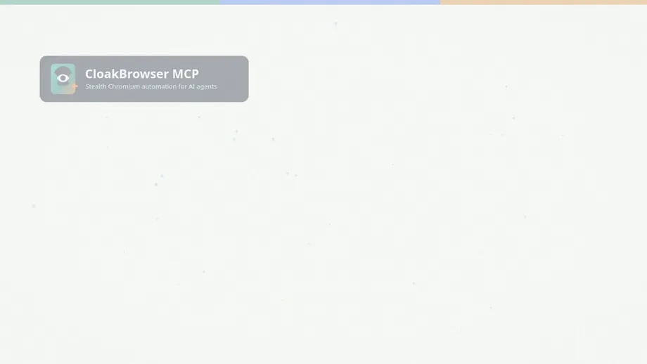

# cloakbrowser-mcp

<p align="center">
  
</p>

[](https://github.com/swimmwatch/cloakbrowser-mcp/actions/workflows/ci.yml)
[](https://codecov.io/gh/swimmwatch/cloakbrowser-mcp)
[](https://github.com/swimmwatch/cloakbrowser-mcp/actions/workflows/actionlint.yml)
[](https://github.com/swimmwatch/cloakbrowser-mcp/actions/workflows/codeql.yml)
[](https://github.com/swimmwatch/cloakbrowser-mcp/actions/workflows/dependency-review.yml)
[](https://github.com/swimmwatch/cloakbrowser-mcp/actions/workflows/scorecard.yml)
[](https://github.com/swimmwatch/cloakbrowser-mcp/actions/workflows/zizmor.yml)
[](https://github.com/swimmwatch/cloakbrowser-mcp/actions/workflows/release.yml)
[](https://github.com/swimmwatch/cloakbrowser-mcp/releases)
[](https://registry.modelcontextprotocol.io/v0.1/servers?search=io.github.swimmwatch%2Fcloakbrowser-mcp)
[](https://glama.ai/mcp/servers/swimmwatch/cloakbrowser-mcp)
[](https://github.com/punkpeye/awesome-mcp-servers)
[](https://www.npmjs.com/package/cloakbrowser-mcp)
[](https://www.npmjs.com/package/cloakbrowser-mcp)
[](https://hub.docker.com/r/swimmwatch/cloakbrowser-mcp)
[](https://hub.docker.com/r/swimmwatch/cloakbrowser-mcp/tags)
[](https://nodejs.org/)
[](tsconfig.json)
[](docs/version-compatibility.md)
[](https://codeguilds.dev/packages/cloakbrowser-mcp)
[](https://modelcontextprotocol.io/)
[](docs/configuration.md)
[](docs/docker.md)
[](LICENSE)
[](https://mcptoplist.com/server/io.github.swimmwatch%2Fcloakbrowser-mcp)

`cloakbrowser-mcp` is a drop-in Playwright MCP-compatible browser automation server with unchanged upstream tools, [CloakBrowser](https://github.com/CloakHQ/CloakBrowser) Chromium, and production-ready npm, Docker, and Streamable HTTP packaging. It runs upstream [`@playwright/mcp`](https://github.com/microsoft/playwright-mcp) as the canonical tool surface and points that runtime at CloakBrowser.

## 30-second demo

[](docs/assets/videos/30-second-demo.mp4)

Run `npx -y cloakbrowser-mcp@latest`, connect Claude Desktop or Codex CLI, ask for web research, daily automation, or testing in plain English, and inspect the real browser result.

Documentation: [swimmwatch.github.io/cloakbrowser-mcp](https://swimmwatch.github.io/cloakbrowser-mcp/) · [Comparison](https://swimmwatch.github.io/cloakbrowser-mcp/comparison/) · [Recipes](https://swimmwatch.github.io/cloakbrowser-mcp/recipes/)

Use it when you need:

- Playwright MCP browser automation backed by CloakBrowser;
- unchanged upstream browser tools plus two local introspection tools;
- npm or Docker installation over stdio or Streamable HTTP;
- persistent browser profiles, validated context options, and Chrome extension loading;
- GeoIP-aware proxy matching for regional QA;
- humanized mouse, keyboard, and scroll behavior for interaction-sensitive flows.

Cross-platform checks cover npm on Linux x64/arm64, macOS arm64/x64, and Windows x64 across Node.js 22 and 24-26. Docker images are built and smoke-tested for `linux/amd64` and `linux/arm64`.

See [`@playwright/mcp` vs `cloakbrowser-mcp`](docs/comparison.md) when deciding whether plain upstream Playwright MCP or CloakBrowser MCP fits a deployment better. The [Recipes](docs/recipes/index.md) pages show task-focused setup paths for persistent login profiles, Chrome extensions, reverse proxies, regional QA, client connections, and CI smoke tests.

## Install With npm

```bash
npx -y cloakbrowser-mcp@latest
```

Requires Node.js 22.13+ in the 22.x line, or Node.js 24+. Run diagnostics before wiring a client:

```bash
npx -y cloakbrowser-mcp@latest doctor
```

For Streamable HTTP instead of stdio:

```bash
npx -y cloakbrowser-mcp@latest --transport streamable-http --http-port 3000
```

See the generated [CLI Reference](https://swimmwatch.github.io/cloakbrowser-mcp/generated/cli/) for all flags.

## Install With Docker

```bash
docker run --rm --init -i \
  -v "$PWD/artifacts:/data" \
  swimmwatch/cloakbrowser-mcp:latest
```

For Streamable HTTP:

```bash
docker run --rm --init -p 127.0.0.1:3000:3000 \
  -v "$PWD/artifacts:/data" \
  swimmwatch/cloakbrowser-mcp:latest \
  --transport streamable-http --http-host 0.0.0.0 --http-port 3000
```

The Docker image writes artifacts to `/data` and is published for `linux/amd64` and `linux/arm64`. It defaults to `CLOAK_PLAYWRIGHT_MCP_NO_SANDBOX=true` for compatibility with containerized runtimes where Chromium sandboxing is often unavailable. If your host and container runtime support Chromium sandboxing, set `CLOAK_PLAYWRIGHT_MCP_NO_SANDBOX=false`; for untrusted pages, keep container network access and mounted host directories tightly scoped. The same tags are also available from `ghcr.io/swimmwatch/cloakbrowser-mcp`. See [Docker](docs/docker.md) for persistent profiles, extension mounts, HTTPS, and smoke-test examples, or use the [reverse proxy recipe](docs/recipes/docker-streamable-http-reverse-proxy.md) for a focused Streamable HTTP deployment.

## Add To MCP Clients

### Codex CLI

```bash
codex mcp add cloakbrowser -- npx -y cloakbrowser-mcp@latest
```

### Claude Code

```bash
claude mcp add --transport stdio cloakbrowser -- npx -y cloakbrowser-mcp@latest
```

### GitHub Copilot In VS Code

```json
{
  "servers": {
    "cloakbrowser": {
      "type": "stdio",
      "command": "npx",
      "args": ["-y", "cloakbrowser-mcp@latest"]
    }
  }
}
```

### Claude Desktop, Cursor, Cline, Windsurf, Warp, And Other `mcpServers` Clients

Add this server entry to the client's MCP JSON config:

```json
{
  "mcpServers": {
    "cloakbrowser": {
      "command": "npx",
      "args": ["-y", "cloakbrowser-mcp@latest"]
    }
  }
}
```

### Docker-backed stdio

```json
{
  "mcpServers": {
    "cloakbrowser": {
      "command": "docker",
      "args": [
        "run",
        "--rm",
        "--init",
        "-i",
        "-v",
        "/tmp/cloakbrowser-artifacts:/data",
        "swimmwatch/cloakbrowser-mcp:latest"
      ]
    }
  }
}
```

### Already-running Streamable HTTP server

```bash
npx -y cloakbrowser-mcp@latest --transport streamable-http --http-port 3000
codex mcp add cloakbrowser --url http://127.0.0.1:3000/mcp
claude mcp add --transport http cloakbrowser http://127.0.0.1:3000/mcp
```

### Prompt For A Code Assistant

Paste this into Codex, Claude Code, Copilot, Cursor, Cline, Windsurf, or a similar coding assistant that can edit MCP config:

```text
Install the CloakBrowser MCP server for this workspace. Name it "cloakbrowser".
Prefer stdio with command "npx" and args ["-y", "cloakbrowser-mcp@latest"].
If this client uses VS Code mcp.json, add it under "servers" with type "stdio".
If this client uses Claude/Cursor/Cline/Windsurf/Warp-style config, add it under
"mcpServers" with the same command and args. Do not add secrets.
```

More examples are in [Getting Started](docs/getting-started.md), with dedicated recipes for [Claude Desktop](docs/recipes/connect-claude-desktop.md) and [Codex CLI](docs/recipes/connect-codex-cli.md).

## Configuration

Use upstream `PLAYWRIGHT_MCP_*` variables for browser, artifacts, timeouts, network, and tool capability settings. Cloak-specific bridge toggles use `CLOAK_PLAYWRIGHT_MCP_*`. Select a Pro Preview browser build before startup with `--release-channel preview` or `CLOAK_PLAYWRIGHT_MCP_RELEASE_CHANNEL=preview`; the default is `stable`.

The common variable table now lives in [Configuration](docs/configuration.md). That page also covers persistent profiles, validated context options, Chrome extensions, Streamable HTTP metadata, and HTTPS/auth options. See [GeoIP Proxy Matching](docs/geoip-proxy-matching.md) for regional proxy behavior, [Humanized Input Behavior](docs/humanized-input-behavior.md) for interaction realism, and [Recipes](docs/recipes/index.md) for task-focused configurations.

## Version Compatibility

<!-- compatibility-table:start -->

| cloakbrowser-mcp | @playwright/mcp | CloakBrowser | Node.js                | Platform                                                                                  |
| ---------------- | --------------- | ------------ | ---------------------- | ----------------------------------------------------------------------------------------- |
| `1.12.0`         | `^0.0.79`       | `^0.5.7`     | `^22.13.0 || >=24.0.0` | npm on Linux x64/arm64, macOS arm64/x64, Windows x64; Docker `linux/amd64`, `linux/arm64` |
| `1.11.0`         | `^0.0.79`       | `^0.5.6`     | `^22.13.0 || >=24.0.0` | npm on Linux x64/arm64, macOS arm64/x64, Windows x64; Docker `linux/amd64`, `linux/arm64` |
| `1.10.0`         | `^0.0.78`       | `^0.5.3`     | `^22.13.0 || >=24.0.0` | npm on Linux x64/arm64, macOS arm64/x64, Windows x64; Docker `linux/amd64`, `linux/arm64` |
| `1.9.0`          | `^0.0.78`       | `^0.5.1`     | `^22.13.0 || >=24.0.0` | npm on Linux x64/arm64, macOS arm64/x64, Windows x64; Docker `linux/amd64`, `linux/arm64` |
| `1.8.0`          | `^0.0.78`       | `^0.4.10`    | `^22.13.0 || >=24.0.0` | npm on Linux x64/arm64, macOS arm64/x64, Windows x64; Docker `linux/amd64`, `linux/arm64` |
| `1.7.0`          | `^0.0.77`       | `^0.4.8`     | `>=22.12`              | npm on Linux x64/arm64, macOS arm64/x64, Windows x64; Docker `linux/amd64`, `linux/arm64` |
| `1.6.1`          | `^0.0.77`       | `^0.4.7`     | `>=22.12`              | npm on Linux x64/arm64, macOS arm64/x64, Windows x64; Docker `linux/amd64`, `linux/arm64` |
| `1.6.0`          | `^0.0.77`       | `^0.4.7`     | `>=22.12`              | npm on Linux x64/arm64, macOS arm64/x64, Windows x64; Docker `linux/amd64`, `linux/arm64` |
| `1.5.0`          | `^0.0.76`       | `^0.4.3`     | `>=22.12`              | npm on Linux x64/arm64, macOS arm64/x64, Windows x64; Docker `linux/amd64`, `linux/arm64` |
| `1.4.0`          | `^0.0.76`       | `^0.3.32`    | `>=22.12`              | npm on Linux x64/arm64, macOS arm64/x64, Windows x64; Docker `linux/amd64`, `linux/arm64` |
| `1.3.0`          | `^0.0.75`       | `^0.3.31`    | `>=20`                 | Docker `linux/amd64`, Node.js local                                                       |
| `1.2.7`          | `^0.0.75`       | `^0.3.30`    | `>=20`                 | Docker `linux/amd64`, Node.js local                                                       |
| `1.2.6`          | `^0.0.75`       | `^0.3.30`    | `>=20`                 | Docker `linux/amd64`, Node.js local                                                       |
| `1.2.5`          | `^0.0.75`       | `^0.3.30`    | `>=20`                 | Docker `linux/amd64`, Node.js local                                                       |
| `1.2.3`          | `^0.0.75`       | `^0.3.30`    | `>=20`                 | Docker `linux/amd64`, Node.js local                                                       |
| `1.2.2`          | `^0.0.75`       | `^0.3.30`    | `>=20`                 | Docker `linux/amd64`, Node.js local                                                       |
| `1.2.1`          | `^0.0.75`       | `^0.3.30`    | `>=20`                 | Docker `linux/amd64`, Node.js local                                                       |
| `1.2.0`          | `^0.0.75`       | `^0.3.30`    | `>=20`                 | Docker `linux/amd64`, Node.js local                                                       |
| `1.1.0`          | `^0.0.75`       | `^0.3.30`    | `>=20`                 | Docker `linux/amd64`, Node.js local                                                       |
| `1.0.2`          | `^0.0.75`       | `^0.3.30`    | `>=20`                 | Docker `linux/amd64`, Node.js local                                                       |
| `1.0.1`          | `^0.0.75`       | `^0.3.30`    | `>=20`                 | Docker `linux/amd64`, Node.js local                                                       |
| `1.0.0`          | `^0.0.75`       | `^0.3.30`    | `>=20`                 | Docker `linux/amd64`, Node.js local                                                       |

<!-- compatibility-table:end -->

See [Version Compatibility](docs/version-compatibility.md) for the maintained compatibility table.

## Tools

The upstream Playwright MCP tool list is authoritative. This project does not reimplement or re-document upstream browser schemas in source code.

Local tools:

- `cloakbrowser_binary_info` returns CloakBrowser package, platform, cache, and resolved binary data.
- `cloakbrowser_bridge_info` returns bridge metadata, upstream package/version, and local tool names.

## Development

```bash
npm install
npm run build
npm test
npm run docker:build
npm run docker:smoke
npm run server:validate
npm run bridge:compare -- cloakbrowser-mcp:dev --report bridge-parity-report.json
```

Documentation starts at [docs/getting-started.md](docs/getting-started.md). Contributor material is grouped under [docs/contributor-guide.md](docs/contributor-guide.md).
