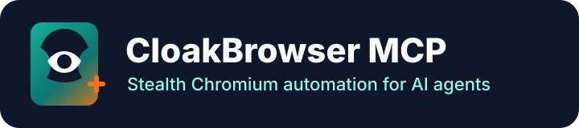

{ width="620" }

  <a class="md-button md-button--primary" href="getting-started/">Primeros pasos</a>
  <a class="md-button" href="tools/">Herramientas</a>
  <a class="md-button" href="docker/">Docker</a>

# Servidor MCP de CloakBrowser

`cloakbrowser-mcp` es un servidor de automatización de navegadores basado en el Protocolo de Contexto de Modelo (MCP) que se ejecuta en la fase previa a `@playwright/mcp` con el binario de CloakBrowser para Chromium. Úsalo cuando necesites herramientas de navegador compatibles con Playwright MCP, ejecución de CloakBrowser, instalación de npm, imágenes de Docker, sesiones HTTP transmitibles, asignación de proxies con reconocimiento de GeoIP para el control de calidad regional o un comportamiento de entrada humanizado para flujos sensibles a la interacción.

Versión actual: {{ project.version_tag }}.

## Compatibilidad entre versiones

<!-- compatibility-table:start -->

| cloakbrowser-mcp | @playwright/mcp | Playwright MCP Docker base                 | CloakBrowser | Transport              | Parity         |
| ---------------- | --------------- | ------------------------------------------ | ------------ | ---------------------- | -------------- |
| `1.6.1`          | `^0.0.77`       | `mcr.microsoft.com/playwright/mcp:v0.0.77` | `^0.4.8`     | stdio, Streamable HTTP | Comparado en CI |
| `1.6.0`          | `^0.0.77`       | `mcr.microsoft.com/playwright/mcp:v0.0.77` | `^0.4.7`     | stdio, Streamable HTTP | Comparado en CI |
| `1.5.0`          | `^0.0.76`       | `mcr.microsoft.com/playwright/mcp:v0.0.76` | `^0.4.3`     | stdio, Streamable HTTP | Comparado en CI |
| `1.4.0`          | `^0.0.76`       | `mcr.microsoft.com/playwright/mcp:v0.0.76` | `^0.3.32`    | stdio, Streamable HTTP | Comparado en CI |
| `1.3.0`          | `^0.0.75`       | `mcr.microsoft.com/playwright/mcp:v0.0.75` | `^0.3.31`    | stdio, Streamable HTTP | Comparado en CI |
| `1.2.7`          | `^0.0.75`       | `mcr.microsoft.com/playwright/mcp:v0.0.75` | `^0.3.30`    | stdio, Streamable HTTP | Comparado en CI |
| `1.2.6`          | `^0.0.75`       | `mcr.microsoft.com/playwright/mcp:v0.0.75` | `^0.3.30`    | stdio, Streamable HTTP | Comparado en CI |
| `1.2.5`          | `^0.0.75`       | `mcr.microsoft.com/playwright/mcp:v0.0.75` | `^0.3.30`    | stdio, Streamable HTTP | Comparado en CI |
| `1.2.3`          | `^0.0.75`       | `mcr.microsoft.com/playwright/mcp:v0.0.75` | `^0.3.30`    | stdio, Streamable HTTP | Comparado en CI |
| `1.2.2`          | `^0.0.75`       | `mcr.microsoft.com/playwright/mcp:v0.0.75` | `^0.3.30`    | stdio, Streamable HTTP | Comparado en CI |
| `1.2.1`          | `^0.0.75`       | `mcr.microsoft.com/playwright/mcp:v0.0.75` | `^0.3.30`    | stdio, Streamable HTTP | Comparado en CI |
| `1.2.0`          | `^0.0.75`       | `mcr.microsoft.com/playwright/mcp:v0.0.75` | `^0.3.30`    | stdio, Streamable HTTP | Comparado en CI |
| `1.1.0`          | `^0.0.75`       | `mcr.microsoft.com/playwright/mcp:v0.0.75` | `^0.3.30`    | stdio, Streamable HTTP | Comparado en CI |
| `1.0.2`          | `^0.0.75`       | `mcr.microsoft.com/playwright/mcp:v0.0.75` | `^0.3.30`    | stdio                  | Comparado en CI |
| `1.0.1`          | `^0.0.75`       | `mcr.microsoft.com/playwright/mcp:v0.0.75` | `^0.3.30`    | stdio                  | Comparado en CI |
| `1.0.0`          | `^0.0.75`       | `mcr.microsoft.com/playwright/mcp:v0.0.75` | `^0.3.30`    | stdio                  | Comparado en CI |

<!-- compatibility-table:end -->

Consulta [Compatibilidad de versiones](version-compatibility.md) para ver la correspondencia actualizada entre las versiones SemVer de este proyecto y las versiones de Playwright MCP del proyecto original.

## ¿Qué es?

- :material-connection: **Ejecución del puente**

  Inicia upstream Playwright MCP como proceso hijo y reenvía sin cambios las llamadas a las herramientas del navegador.

- :material-incognito: **Ejecución de CloakBrowser**

  Genera una configuración de Playwright MCP con `launchOptions.executablePath` apuntando a CloakBrowser.

- :fontawesome-brands-node-js: **npm CLI**

  Se publica como un paquete CLI ligero de Node.js para clientes MCP por stdio y Streamable HTTP.

- :fontawesome-brands-docker: **Imagen Docker**

  Se basa en la imagen oficial de Playwright MCP y precarga la caché del binario de CloakBrowser.

- :material-map-marker-radius: **Coincidencia GeoIP del proxy**

  Alinea la zona horaria, el idioma y la configuración regional de la huella de CloakBrowser con la ubicación del proxy configurado.

- :material-gesture-tap: **Comportamiento de entrada humanizado**

  Dirige las interacciones de la página mediante la capa de ratón, teclado y desplazamiento de CloakBrowser con comportamiento similar al humano.

## Superficie de la herramienta

Los contratos de la herramienta Playwright MCP, situada en la fase previa, son los que prevalecen. Este proyecto solo añade dos herramientas de introspección locales:

- `cloakbrowser_binary_info`
- `cloakbrowser_bridge_info`

## Próximos pasos

- [Primeros pasos](getting-started.md) para la configuración de npm, Docker y el cliente MCP.
- [Configuración](configuration.md) de las variables de entorno compatibles.
- [Coincidencia de proxy GeoIP](geoip-proxy-matching.md) para el control de calidad regional, los metadatos del proxy en tiempo de ejecución y las sesiones HTTP «Streamable» en múltiples ubicaciones.
- [Comportamiento humanizado de la entrada](humanized-input-behavior.md) para el realismo de la interacción, la configuración y los casos de uso.
- [Herramientas](tools.md) para definir las expectativas de la interfaz de las herramientas y la paridad con los componentes de origen.
- [Preguntas frecuentes](faq.md) sobre cuestiones comunes relacionadas con la instalación, Docker, la paridad y la seguridad.
- [Guía para colaboradores](contributor-guide.md) con detalles sobre el desarrollo, las pruebas, la arquitectura y las versiones.
